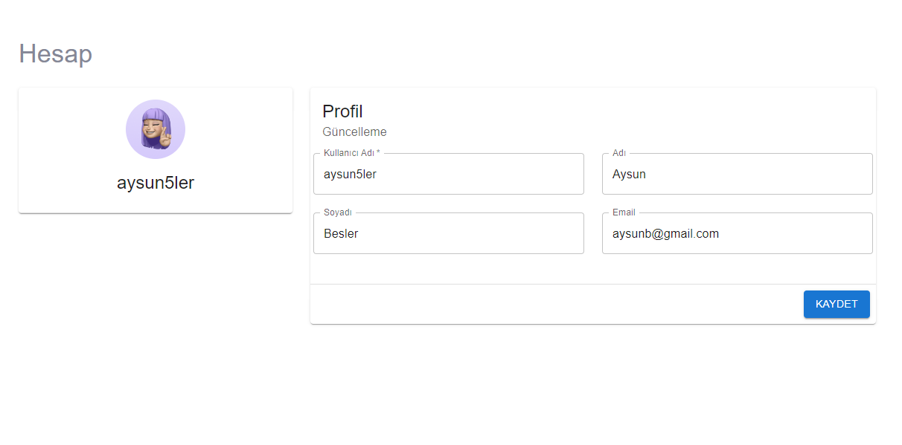

# Personal Accounting Application

The Personal Accounting Application is a tool for individuals to track their financial transactions, maintain records, and monitor their financial status.
This application has been developed using Spring Boot, React and Docker technologies.

## Login Page

The page to start using the application requires you to log in.

## Registration Page

A page used to create a new account for the application.

## User Dashboard

The user dashboard features:
- Cards displaying the total investment, income, expenses, and budget.
- A graph showing annual income and expenses.
- A table listing upcoming payments.

## User Detail Page

A page used when the user wants to see monthly income and expenses in detail.

## Income/Expense/Investment Management

Users can efficiently manage their income, expenses, and investments with these features. You can add, delete, or update your financial records as needed.

## User Profile Update

Users can use this page to update their personal information.

This application provides a comprehensive tool for personal finance management. With a user-friendly interface and detailed data tracking features, it helps you better manage your financial situation.
